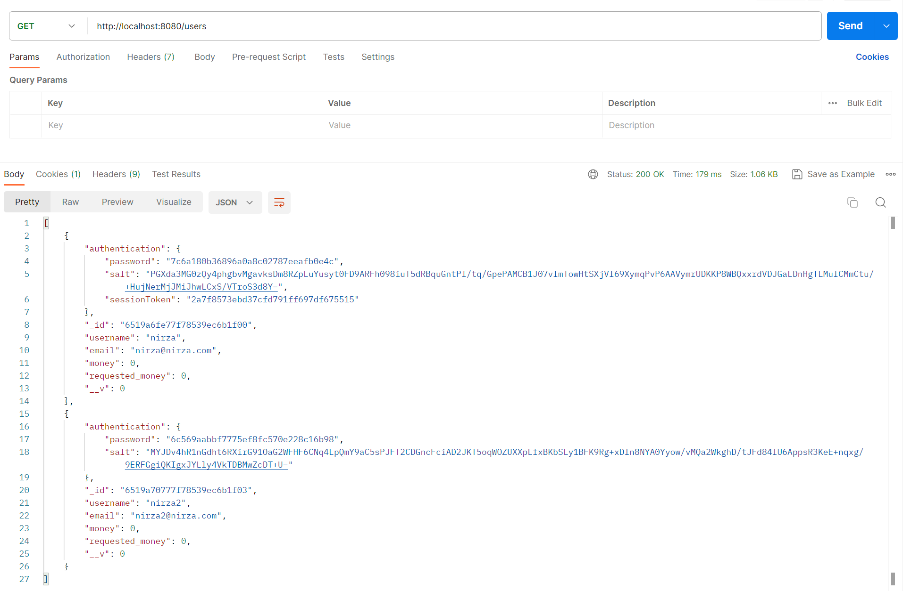
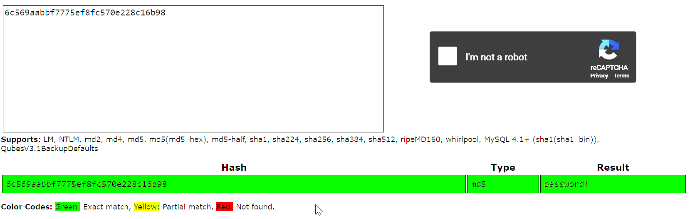

## Introduction

After creating my vulnerable django web app I was looking to further my knowledge by creating a vulnerable REST API based on Node, Express, TypeScript and MongoDB.

### Functionality

This app consists of the functionalities:

1. Register and Login
2. List all of the users after Log-in as some user
3. Delete a user (only ourselves)
4. Make adjustments to our user
5. Request money to our user
6. Add an item that we will be able to buy or sell
7. Buy an item
8. Sell an Item

### Inbuilt Business logic vulnerabilities

During the building of this app I inserted for fun several inbuilt Business logic vulnerabilities that one can look up for them.

I will also explain in this note how to exploit the Business logic vulnerabilities I inserted in purpose to the app and how to patch them, have fun!

### Postman Collection for ease of use

In this repository you will be able to find the the Postman Collection for easy interaction with the API.

## Table of Contents

[Data leakage](https://github.com/nirzaaa/vulnerableAPI#data-leakage)

[Weak Password Requirements](https://github.com/nirzaaa/vulnerableAPI#weak-password-requirements)

[Race condition](https://github.com/nirzaaa/vulnerableAPI#race-condition)

## Data leakage

After log-in as `nirza` and trying to see the data of all of the users, I will be able to see their salt, password and sessionToken:


This way I will be able to log-in as them and also to crack their password.

In order to patch this we will have to go to `src -> db -> users.ts` and adjust `select: false`:
```
password: { type: String, required: true, select: false },
```

Without the `select: false`, it will show the data to all of the API users.


## Weak Password Requirements

After leaking the hashes of the others api users, we are able to crack their password quiet easily:


In order to fix it, we are able to use `SECRET` and also `salt` to make the cracking of the hashes much more difficult by going to `src -> helpers -> index.ts`:
```typescript
import crypto from 'crypto';

const SECRET = 'NIRZA-REST-API';

export const random = () => crypto.randomBytes(128).toString('base64');
export const authentication = (salt: string, password: string) => {
    // return crypto.createHash('md5').update(password).digest('hex');
    return crypto.createHmac('sha256', [salt, password].join('/')).update(SECRET).digest('hex');
};
```

## Race condition

While trying to request money we will get to this:
```typescript
if ( money_to_add > 99 || existingUser.requested_money == 1 ) {
    return res.sendStatus(400);
}

existingUser.money += money_to_add;
existingUser.requested_money = 1;

await existingUser.save()
```

We can try to send several requests in parallel in order to bypass the restriction of the amount of money that we are able to have.
